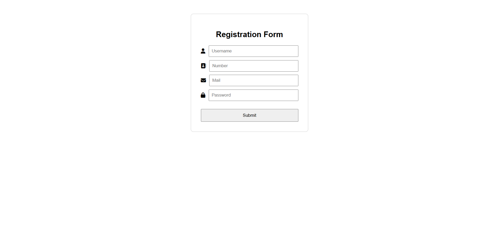

# 🔐 Form Validation using Regex

A simple yet secure HTML form with real-time validation using **JavaScript & Regular Expressions**. The form ensures strong password policies, valid name, email & contact formats — making it user-ready & robust.

---

## 📚 What I Learned

- How to use **Regex** for real-time password strength validation
- Validating contact numbers to ensure exactly **10 digits**
- Verifying email structure using standard **email regex**
- Name field validation using **only letters and spaces**
- DOM access & manipulation using `.value`, `.textContent`, `.addEventListener`
- Error messaging in real-time & on submit

---

## 💡 Features

- 👨 Name: must include only letters and spaces  
- 📞 Contact: 10-digit only, no spaces or special chars  
- 📧 Email: must follow valid email format  
- 🔐 Password: live feedback with strong rule check (8+ chars, 1 uppercase, 1 lowercase, 1 digit, 1 special char)

```js
Regex used:
Name     -> /^[A-Za-z\s]+$/
Contact  -> /^\d{10}$/
Email    -> /^[^\s@]+@[^\s@]+\.[^\s@]{2,}$/
Password -> /^(?=.*[a-z])(?=.*[A-Z])(?=.*\d)(?=.*[@$!%*?&]).{8,}$/

---

## 📸 UI Preview


